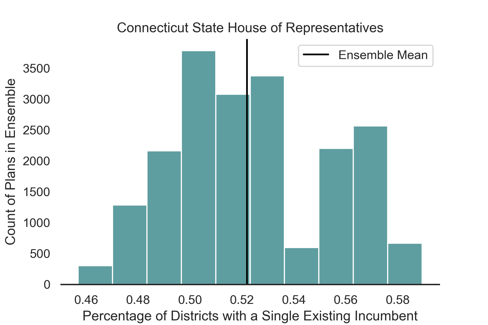
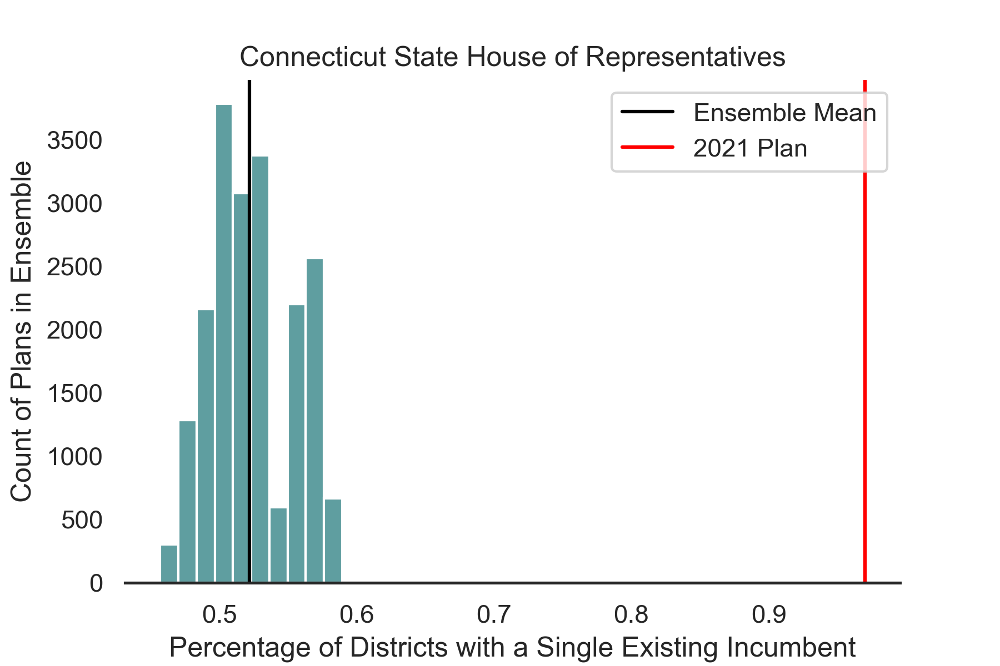

# Connecticut Redistricting Analysis

The Connecticut Supreme Court approved [new state district plans](https://www.cga.ct.gov/rr/taskforce.asp?TF=20210401_2021%20Redistricting%20Project) on February 10, 2022. Yet the final maps have drawn critique about incumbent protection, since 97% of the newly drawn districts for the CT State House of Representatives and 100% of the CT State Senate were drawn to include a single current incumbent. These figures indicate that incumbent addresses may have factored into the redistricting process in order to protect existing incumbents and to prevent current incumbents from competing with each other within a newly drawn districts. The following analysis will conduct an ensemble analysis study of the final Connecticut's [2021 State House of Representatives](https://www.cga.ct.gov/rr/tfs/20210401_2021%20Redistricting%20Project/NODISPLAY_data/housemaps/Map-Statewide/2021HouseFinal.pdf) and [State Senate redistricting plan maps](https://www.cga.ct.gov/rr/tfs/20210401_2021%20Redistricting%20Project/NODISPLAY_data/senatemaps/Map-Statewide/2021SenateFinal.pdf) and analyze if the percentages of incumbent presence can statistically be considered an outlier within the universe of potential redistricting plans.

## Ensemble Analysis

The following analysis employs Markov Chain Monte Carlo (MCMC) methods to consider the range of potential district plans. A Markov Chain is a random walk that is a sequence of random variables, where the distribution of each variable only depends on the outcome of the previous variable. MCMC use Markov Chains to sample from a steady state distribution without having to know the specific probabilities associated with the target distribution. Configurations in the state space are explored with more steps taken until the chains converge to a stable distribution. Monte Carlo sample is a random sampling of multiple Markov chains to create a distribution of possible plans. GerryChain is a Python library that uses MCMC methods to study political redistricting problems by computationally generating redistricting plans from a distribution that accounts for legal rules specific to each state's unique context. An ensemble analysis can compare a specific plan (i.e., the recently passed 2021 maps) across the distribution of all potential plans and note if the plan is an outlier. Thus, the question of these analyses is: does incumbent count in the Connecticut 2021 redistricting plan for the State House and State Senate represent an extreme outlier among possible district plan proposals?

I conduct an ensemble analysis for the CT House of Representatives (151 districts) and the CT State Senate (36 districts) that tracks the count of incumbents that live within newly drawn districts. CT's redistricting legal rules require that district plans adhere to federal requirements (i.e., Voting Rights Act), equal population balance, that district shapes should be compact and contiguous, and that town splits are minimized where possible ("For the purpose of forming assembly districts no town shall be divided except for the purpose of forming assembly districts wholly within the town.") When accounting for legal rules and with *no* consideration for incumbent protection, I hypothesize that the percentage of current incumbents in the newly drawn CT House and CT Senate are lower than the 97% reported in the 2021 redistricting maps.

Each ensemble is generated from a random seed proposal with a ReCom proposal across 20,000 steps, which [previous](https://mggg.org/VA-report.pdf) [research](https://arxiv.org/abs/1911.05725) has noted as sufficient to reach a steady distribution. Town splits were minimized using an acceptance function that coerced the chain to only accept a next step with fewer town splits than the current step. The model and GerryChain runs can be viewed here.

For CT State House maps, the ensemble mean of districts that contain a single incumbent is 54% compared to the 97% figure in the 2020 State House map. Another summary is that amongst 20,000 drawn plans in my ensemble, on average 46% of the drawn 151 CT House districts contain either no current incumbent or two or more incumbents within its new boundaries. This is compared to the 3% figure of the passed 2021 State House district maps, which indicates the 2021 CT State House map is an extreme outlier in terms of incumbent placement in newly drawn district boundaries.

